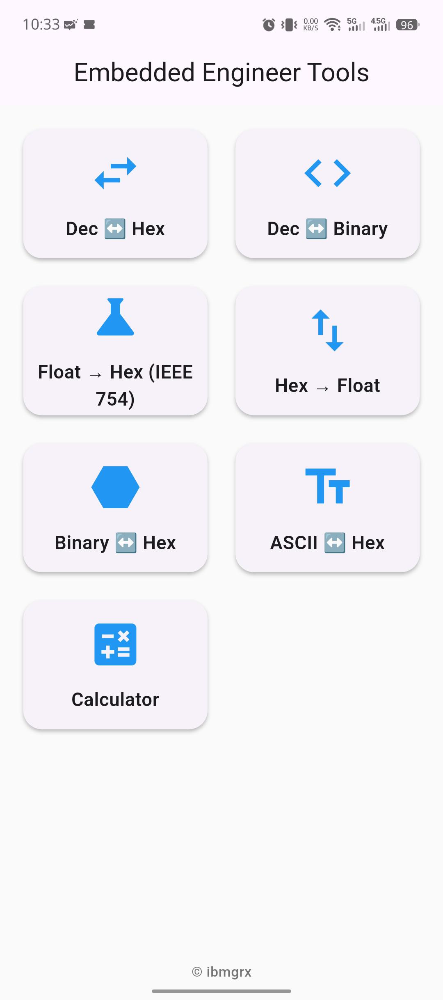
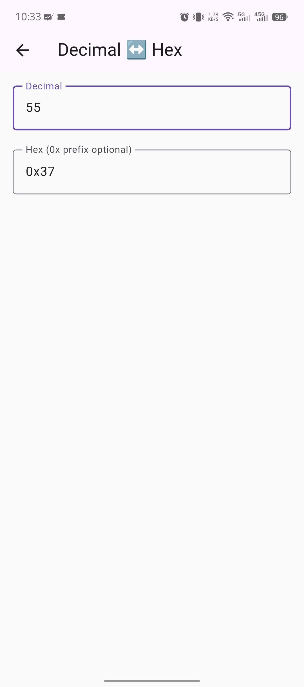
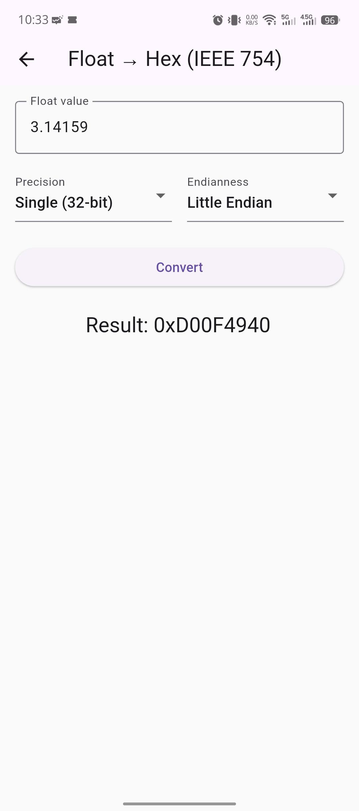
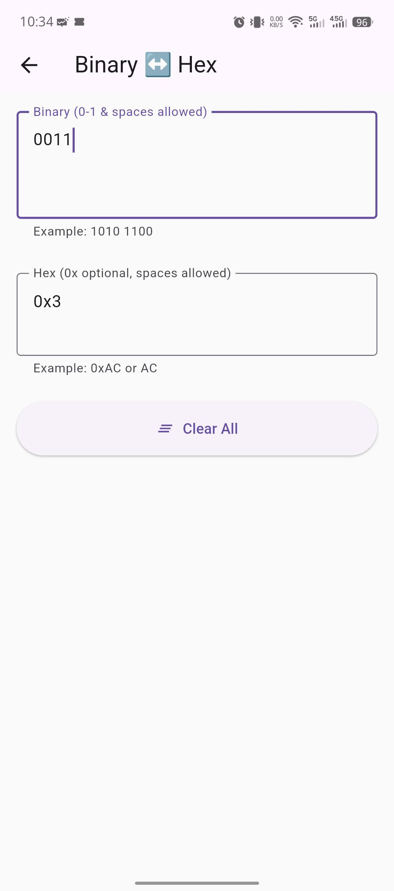
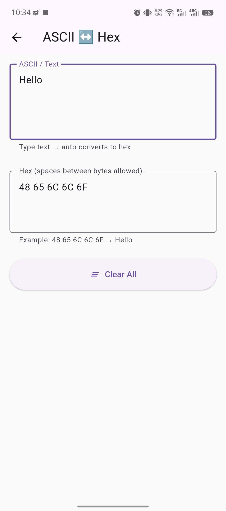
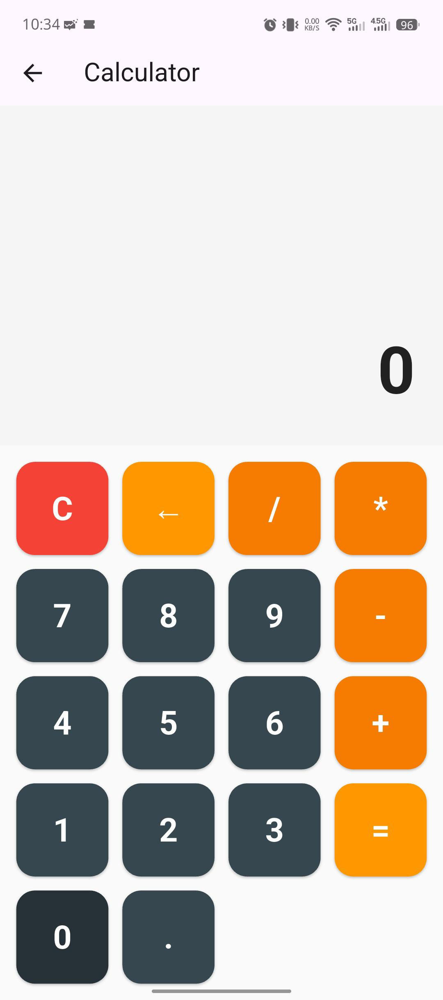

# Embedded Engineer Tools

A lightweight, offline Flutter mobile application designed specifically for embedded engineers and microcontroller programmers.  
Quickly convert between common data formats used in debugging, register manipulation, serial communication, and low-level programming.

## Features

- **Decimal ↔ Hex** conversion
- **Decimal ↔ Binary** (8/16/32-bit, with padding & spacing)
- **Float → Hex** (IEEE 754 single/double precision, Big/Little Endian)
- **Hex → Float** (IEEE 754 decoding)
- **Binary ↔ Hex** (live conversion)
- **ASCII ↔ Hex** (string to hex bytes and vice versa, live)
- **Simple Calculator** (with decimal point & backspace)

All conversions are **live** (update instantly while typing) on supported screens, with clean input validation and clear buttons.  
No internet required — 100% offline and lightweight.

## Screenshots

<!-- Replace the paths below with actual image paths after uploading screenshots to the repo -->

| Home Screen                  | Decimal ↔ Hex                | Float → Hex (IEEE 754)       |
|------------------------------|------------------------------|------------------------------|
|  |  |  |

| Binary ↔ Hex                 | ASCII ↔ Hex                  | Calculator                   |
|------------------------------|------------------------------|------------------------------|
|  |  |  |

*(Add more screenshots as needed)*

## Tech Stack

- Flutter (Dart)
- Pure Dart: `dart:typed_data`, `dart:convert`
- Material 3 design
- No external packages (zero dependencies beyond Flutter SDK)

## Installation (for testing)

1. Clone the repository:
   ```bash
   git clone https://github.com/ibmgrx/embedded-engineer-tools.git
   cd embedded-engineer-tools